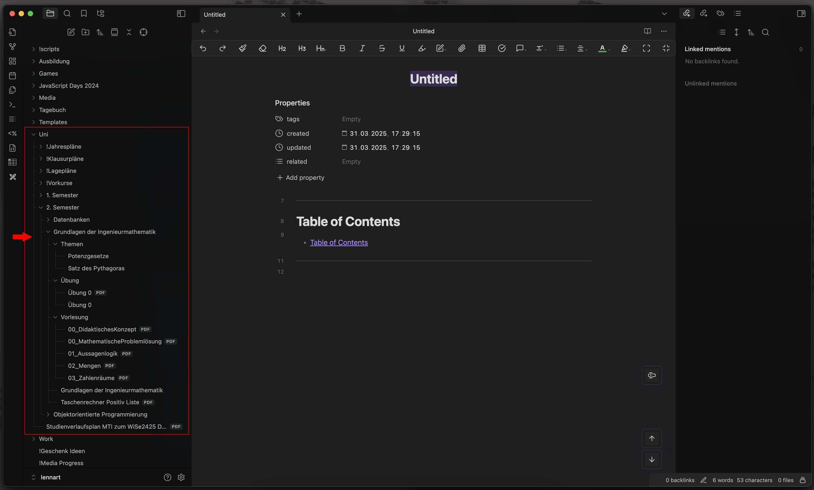

# Enhanced file explorer tree

This repository contains a custom theme plugin for [Obsidian](https://obsidian.md/), designed to enhance the file explorer tree by making the folder structure more visually intuitive. The primary goal is to clearly illustrate which files belong to which folders through subtle yet effective styling.

## Features

- **Improved Folder Hierarchy**: Adds horizontal and vertical lines using pseudo-elements (`:before`) to visually connect files and folders in the explorer tree.
- **Light and Dark Mode Support**: Seamlessly adapts to your system’s color scheme (`light dark`) with customizable background colors.
- **Subtle Visual Cues**: Uses CSS variables (e.g., `--bg-color`) to create faint lines that improve readability without cluttering the interface.
- **Minimalist Approach**: Keeps the original [Obsidian](https://obsidian.md/) design and is only focusing on visual functionality.